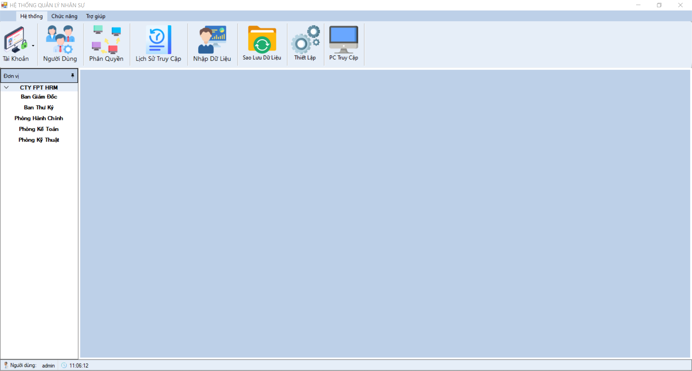

# Giao diện hệ thống quản lý nhân sự

### DEMO GIAO DIỆN QL NHÂN SỰ

### Mô tả
Hệ thống quản lý nhân sự là một giao diện ứng dụng giúp quản lý thông tin nhân viên hiệu quả, bao gồm các tính năng:
- Quản lý danh sách nhân viên.
- Cập nhật thông tin nhân viên.
- Thêm mới hoặc xóa nhân viên.
- Tra cứu thông tin theo tên, mã nhân viên hoặc các tiêu chí khác.

### Các tính năng chi tiết

1. Danh sách nhân viên
   - Hiển thị danh sách nhân viên trong cơ sở dữ liệu.
   - Cho phép tra cứu nhanh bằng thanh tìm kiếm.

2. Thêm nhân viên
   - Form nhập liệu dễ dàng.
   - Kiểm tra tính hợp lệ của dữ liệu trước khi thêm mới.

3. Chỉnh sửa thông tin nhân viên
   - Cập nhật thông tin nhân viên như họ tên, phòng ban, chức danh, lương.

4. Xóa nhân viên
   - Xóa những nhân viên không còn làm việc.
   - Hiển thị cảnh báo trước khi xóa.

5. Giao diện trực quan
   - Sử dụng giao diện người dùng thân thiện và dễ sử dụng.

### Công nghệ sử dụng

- Ngôn ngữ lập trình: C#
- Môi trường: Windows Forms

## Yêu cầu

- Microsoft .NET Framework.

## Hướng dẫn cài đặt

1. Clone repo vào máy tính của bạn. thiết.
2. Mở project bằng Visual Studio.
3. Build và chạy project.

[Link youtube]()

